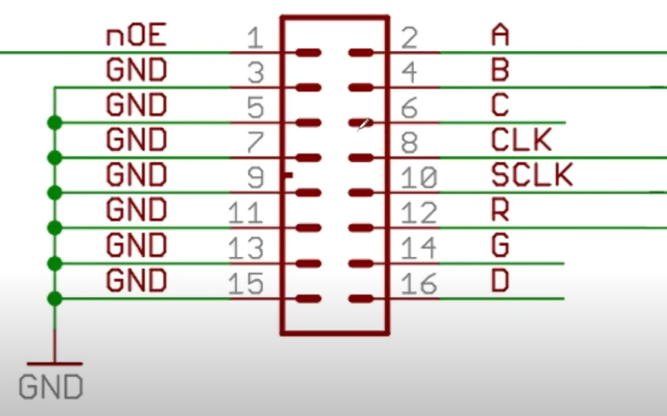
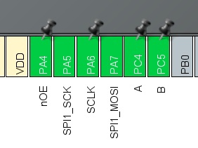
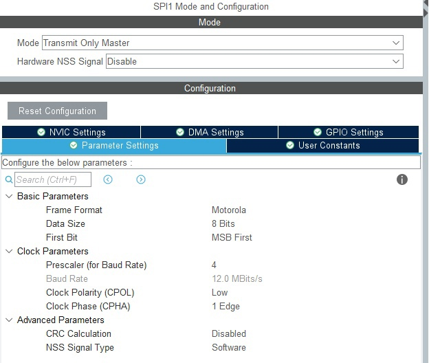
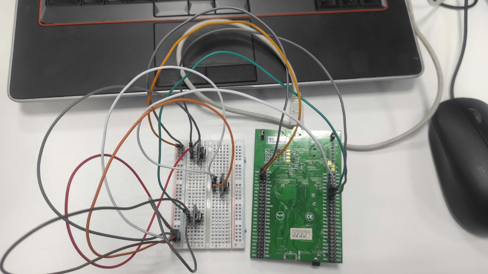

# Выполнение лабораторной работы №1 
Лаборная работа представляет из себя работу с лед панелью P10
## Задание
Сделать игру "сапер", 4x2, с возможностью перещаться по осям X и Y
## Подключение панели
Лаборная работа представляет из себя работу с лед панелью P10
Первый этап работы это подключение панели к STM32, она имеет следующее подключение:


В STM32CubeMX эти выходы подключаются к следующим пинам:


Также, необходимо настроить SPI1:

## Подключение кнопок
Для выполнения задания необходимо добавить 3 кнопки:
кнопка 1 | кнопка 2| кнопка 3
:----|:----:|----:
активация клетки| перемещение по оси X | перемещение по оси Y

Кнопки подключены к макетной плате следующим образом:


Схема подключений в STM32CubeMX:
Наименование | Пин
:----|----:
Кнопка 1 | PC2
Кнопка 2 | PA1
Кнопка 2| PA2
\+ | 5V
\- | GND

## Написание кода
Первым делом были подключены файлы disp1color.c и disp1color.h, в них реализованы функции рисования пикселя и также строк, они будут использованы, для дальнейшего написания кода. Первым делом была нарисована сетка:
```
disp1color_DrawLine(0,0,28,0);
disp1color_DrawLine(0,14,28,14);
disp1color_DrawLine(0,7,28,7);
disp1color_DrawLine(0,0,0,14);
disp1color_DrawLine(7,0,7,14);
disp1color_DrawLine(14,0,14,14);
disp1color_DrawLine(21,0,21,14);
disp1color_DrawLine(28,0,28,14);
```
Затем были реализованы функции для отрисовки каждой клетки:

```
void oneone()
{
	disp1color_DrawLine(24,8,26,8);
	disp1color_DrawLine(25,8,25,13);
	disp1color_DrawPixel(26,12,1);
}
void onetwo()
{
	disp1color_DrawLine(15,8,20,13);
	disp1color_DrawLine(20,8,15,13);
}
void onethree()
{
	disp1color_DrawLine(8,8,13,13);
	disp1color_DrawLine(13,8,8,13);
}
void onefour()
{
	  disp1color_DrawLine(1,8,5,8);
	  disp1color_DrawPixel(5,9,1);
	  disp1color_DrawPixel(5,12,1);
	  disp1color_DrawPixel(1,12,1);
	  disp1color_DrawPixel(4,10,1);
	  disp1color_DrawLine(2,11,3,11);
	  disp1color_DrawLine(2,13,4,13);
}
void twoone()
{
	  disp1color_DrawLine(24,1,26,1);
	  disp1color_DrawLine(25,1,25,6);
	  disp1color_DrawPixel(26,5,1);
}
void twotwo()
{
	  disp1color_DrawPixel(15,2,1);
	  disp1color_DrawPixel(19,2,1);
	  disp1color_DrawPixel(15,5,1);
	  disp1color_DrawPixel(19,5,1);
	  disp1color_DrawLine(16,1,18,1);
	  disp1color_DrawLine(16,3,17,3);
	  disp1color_DrawLine(16,4,17,4);
	  disp1color_DrawLine(18,6,16,6);
}
void twothree()
{
	  disp1color_DrawLine(8,1,13,6);
	  disp1color_DrawLine(13,1,8,6);
}
void twofour()
{
	  disp1color_DrawLine(1,1,5,1);
	  disp1color_DrawPixel(5,2,1);
	  disp1color_DrawPixel(5,5,1);
	  disp1color_DrawPixel(1,5,1);
	  disp1color_DrawPixel(4,3,1);
	  disp1color_DrawLine(2,4,3,4);
	  disp1color_DrawLine(2,6,4,6);
}
void blacktwofour()
{
	 disp1color_DrawPixel(1,1,0);
	 disp1color_DrawPixel(2,1,0);
	 disp1color_DrawPixel(3,1,0);
	 disp1color_DrawPixel(4,1,0);
	 disp1color_DrawPixel(5,1,0);
	 disp1color_DrawPixel(5,2,0);
	 disp1color_DrawPixel(4,3,0);
	 disp1color_DrawPixel(3,4,0);
	 disp1color_DrawPixel(2,4,0);
	 disp1color_DrawPixel(1,5,0);
	 disp1color_DrawPixel(5,5,0);
	 disp1color_DrawPixel(2,6,0);
	 disp1color_DrawPixel(3,6,0);
	 disp1color_DrawPixel(4,6,0);
}
```
Затем были обработы нажатия кнопок и был написан код, для отрисовки ячеек при нажатии на кнопку 1:
```
st1 = !(HAL_GPIO_ReadPin(button_GPIO_Port,button_Pin));
st2 = !(HAL_GPIO_ReadPin(button2_GPIO_Port,button2_Pin));
st3 = !(HAL_GPIO_ReadPin(button3_GPIO_Port,button3_Pin));
	if(st1 == 1 && stflag1==0 )
	{
		stflag1=1;
		if (x==6 && y==4)
		{
			twofour();
			cnt24 =1;
		}
		if (x==13 && y==4)
		{
			twothree();
			cnt23 =1;
		}
		 if (x==20 && y==4)
		{
		    twotwo();
		  	cnt22 =1;
		}
		if (x==27 && y==4)
		{
			twoone();
		 	cnt21 =1;
		 }
		if (x==6 && y==11)
		{
		    onefour();
		 	cnt14 =1;
		}
		if (x==13 && y==11)
		{
			onethree();
			cnt13 =1;
		}
		if (x==20 && y==11)
		{
		    onetwo();
		    cnt12 =1;
		}
		if (x==27 && y==11)
		{
			oneone();
			cnt11 =1;
		}
	}
	if (st1 ==0 && stflag1==1)
	{
		stflag1=0;
	} 
```
Далее былы написаны функция для отрисовки квадрата и закрашивания квадрата, а также была описана работа кнопок 2 и 3 :
```
void drrec(int16_t x1, int16_t y1, int16_t x2, int16_t y2)
{
	for(uint8_t i = y2; i <= y1; i++)
	{
		 disp1color_DrawLine(x1,i,x2,i);
	}	
}
void blackrec (int16_t x1, int16_t y1, int16_t x2, int16_t y2)
{
	disp1color_DrawPixel(x1,y1,0);
	disp1color_DrawPixel(x1-1,y1,0);
	disp1color_DrawPixel(x2,y2,0);
	disp1color_DrawPixel(x2+1,y2,0);
}

if(st2 == 1 && stflag2==0 )
{
	stflag2=1;
	oldx=x;
	oldy=y;

	if (x == 27)
	{
	        =6;
	}
	else{
	    x = x+7;
	}
	    drrec(x,y,x-1,y-1);
	    blackrec(oldx,oldy,oldx-1,oldy-1);
}
if (st2 ==0 && stflag2==1)
{
	stflag2=0;
}


if(st3 == 1 && stflag3==0 )
{
	stflag3=1;
	oldx=x;
	oldy=y;
		if (y == 11)
		{
			y=4;
		}
		else
		{
			y = y+7;
		}
	drrec(x,y,x-1,y-1);
	blackrec(oldx,oldy,oldx-1,oldy-1);
}
if (st3 ==0 && stflag3==1)
{
	stflag3=0;
}
```
Код реализован таким образом, что квадрат перемещается по координатам, значения координат записываеюся в координаты oldx и oldy, а потом на этих координах квадрат обратно зарисовывается. 

Последним этапом были написаны функции надписи you lose, при условии попадания на мину и you win, при условии победы, а также функции очищения клеток:
```
void you()
{
	//Y
	disp1color_DrawLine(24,8,24,9);
	disp1color_DrawPixel(23,10,1);
	disp1color_DrawPixel(25,10,1);
	disp1color_DrawLine(26,11,26,13);
	disp1color_DrawLine(22,11,22,13);
	//O
	disp1color_DrawLine(15,8,15,13);
	disp1color_DrawLine(19,8,19,13);
	disp1color_DrawLine(19,8,15,8);
	disp1color_DrawLine(19,13,15,13);
	//U
	disp1color_DrawLine(8,8,8,13);
	disp1color_DrawLine(12,8,12,13);
	disp1color_DrawLine(12,8,8,8);
}

void lose()
{
	//L
	disp1color_DrawLine(26,1,26,6);
	disp1color_DrawLine(26,1,22,1);

	//O
	disp1color_DrawLine(15,1,15,6);
	disp1color_DrawLine(19,1,19,6);
	disp1color_DrawLine(19,1,15,1);
	disp1color_DrawLine(19,6,15,6);

	//S
	disp1color_DrawLine(9,1,11,1);
	disp1color_DrawLine(9,6,11,6);
	disp1color_DrawLine(9,3,10,3);
	disp1color_DrawPixel(8,2,1);
	disp1color_DrawPixel(12,5,1);
	disp1color_DrawPixel(11,4,1);

	//E
	disp1color_DrawLine(1,1,5,1);
	disp1color_DrawLine(2,4,5,4);
	disp1color_DrawLine(1,6,5,6);
	disp1color_DrawLine(5,1,5,6);
}

void win()
{
	//w
	disp1color_DrawPixel(25,1,1);
	disp1color_DrawPixel(23,1,1);
	disp1color_DrawLine(26,2,26,6);
	disp1color_DrawLine(22,6,22,2);
	disp1color_DrawLine(24,2,24,4);

	//I
	disp1color_DrawLine(18,1,18,6);
	disp1color_DrawLine(19,1,17,1);
	disp1color_DrawLine(19,6,17,6);

	//N
	disp1color_DrawLine(8,1,8,6);
	disp1color_DrawLine(12,1,12,6);
	disp1color_DrawPixel(9,3,1);
	disp1color_DrawPixel(10,4,1);
	disp1color_DrawPixel(11,5,1);
}


if (cnt12==1 || cnt13==1 || cnt23==1)
{
	blackarea(27,13,1,1);
	you();
	lose();
}

if (cnt11==1 && cnt21==1 && cnt22==1 && cnt14==1 && cnt24==1)
{
	blackarea(27,13,1,1);
	you();
	win();
}
```
## Результат работы
Ниже представлена ссылка на видео, в котором наглядно представлен принцип работы программы:
https://youtu.be/cHHstprHVTc

